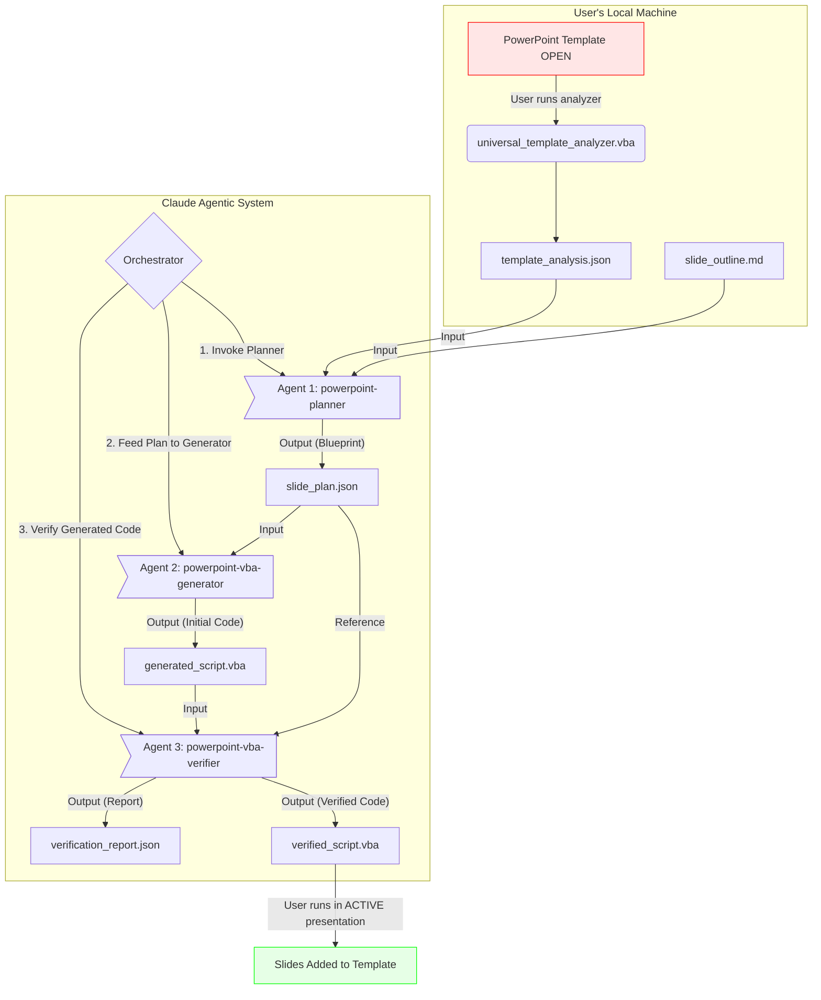

# CLAUDE.md: PowerPoint Automation System

This document outlines the architecture, agents, and orchestration logic for the Claude-powered PowerPoint Automation System. Its purpose is to transform a user's content outline into a ready-to-use, verified VBA script, tailored to a specific PowerPoint template.

## 1. System Overview & Purpose

The primary goal of this system is to automate the creation of PowerPoint presentations by adding slides to an existing template presentation. It bridges the gap between a user's abstract ideas (a slide outline) and the technical requirements of a specific presentation template, with built-in verification to ensure the code actually works.

**CRITICAL: The system adds slides to the user's ACTIVE presentation, it does NOT create a new presentation.**

The system is designed around a core principle of **Separation of Concerns**, where distinct agents handle specific, non-overlapping tasks. This ensures robustness, simplifies debugging, and allows for specialized agent prompts.

## 2. Core Components

The system consists of four main parts: a user-side tool, three specialized agents, and a series of structured data artifacts that flow between them.

*   **User-Side Tool:**
    *   `universal_template_analyzer.vba` (v3.1): A VBA script the user runs locally within PowerPoint to extract its template structure into a `template_analysis.json` file.

*   **Agentic Workforce:**
    *   `powerpoint-planner` (v2.0): The "Strategist". This agent interprets the user's request and matches it against the template's capabilities.
    *   `powerpoint-vba-generator` (v4.0): The "Developer". This agent writes VBA code based on a precise, pre-defined plan.
    *   `powerpoint-vba-verifier` (v3.0): The "Quality Assurance". This agent validates the generated VBA script for critical issues.

*   **Data Artifacts (The "Assembly Line"):**
    *   `template_analysis.json`: The raw data describing the template's layouts and available placeholders.
    *   `slide_outline.md`: The user's input describing the desired presentation content in a free-form text or markdown format.
    *   `slide_plan.json`: The **key intermediate artifact**. It is a highly structured blueprint that maps content to layouts with actual data.
    *   `generated_script.vba`: The initial VBA script output.
    *   `verification_report.json`: A detailed report of the verification process, including any issues found and corrections made.
    *   `verified_script.vba`: The final, verified and corrected VBA script ready for production use.

## 3. Critical Requirements for Working Scripts

### The Generated VBA Script MUST:

1. **Use the Active Presentation**
   ```vba
   ' CORRECT
   Set pres = Application.ActivePresentation
   
   ' WRONG - Never create new presentation
   Set pres = Application.Presentations.Add
   ```

2. **Have Main Entry Point Named `Main()`**
   ```vba
   Sub Main()  ' Correct - user can just press F5
   ```

3. **Use Layout Indices from the Plan**
   - Read `selected_layout.index` from slide_plan.json
   - Apply using `ppLayoutCustom` and `CustomLayout`

4. **Populate Actual Content**
   - Tables with real data (e.g., "Arc'teryx", "Asian fit...")
   - Not generic placeholders like "Data 1,2"

## 4. Orchestration & Data Flow

The system operates in a strict, linear sequence with verification. The orchestrator's role is to invoke the correct agent at each step and pass the data artifacts between them.



### Step-by-Step Execution:

1. **Pre-computation (User)**: User opens their template in PowerPoint, runs `universal_template_analyzer.vba` to generate `template_analysis.json`.

2. **Invocation (User -> Orchestrator)**: User provides `template_analysis.json` and `slide_outline.md` to the system.

3. **Planning Phase (Orchestrator -> planner)**: Creates detailed `slide_plan.json` with layout mappings and structured content.

4. **Generation Phase (Orchestrator -> generator)**: Produces `generated_script.vba` that uses ActivePresentation and actual content.

5. **Verification Phase (Orchestrator -> verifier)**: Checks critical issues and produces `verified_script.vba`.

6. **Execution (User)**: User runs `Main()` in their OPEN presentation to add slides.

## 5. Agent Definitions

### powerpoint-planner (v2.0)
- **Description**: Creates detailed slide-by-slide plan with structured content
- **Input**: `template_analysis.json`, `slide_outline.md`
- **Output**: `slide_plan.json` with layout indices and actual content data
- **Key Responsibility**: Map content to correct layouts with proper indices

### powerpoint-vba-generator (v4.0)
- **Description**: Generates WORKING VBA script from structured plan
- **Input**: `slide_plan.json`
- **Output**: `generated_script.vba`
- **Critical Requirements**:
  - MUST use `Application.ActivePresentation`
  - MUST name main sub `Main()`
  - MUST use layout indices from plan
  - MUST populate actual content data

### powerpoint-vba-verifier (v3.0)
- **Description**: Validates and corrects VBA scripts
- **Input**: `generated_script.vba`, `slide_plan.json`
- **Output**: `verification_report.json`, `verified_script.vba`
- **Critical Checks**:
  - Uses active presentation (not creating new)
  - Main sub named `Main()`
  - Layout indices match plan
  - Actual content populated

## 6. Common Failures and Fixes

| Issue | Symptom | Fix |
|-------|---------|-----|
| Creates new presentation | Blank presentation opens | Use `Application.ActivePresentation` |
| Wrong entry point | Can't run with F5 | Name main sub `Main()` |
| Wrong layout indices | Slides have wrong layouts | Read indices from plan |
| Generic content | Tables show "Data 1,2" | Populate actual data from plan |
| No slides appear | Script runs but nothing happens | Check placeholder finding logic |

## 7. User Workflow

1. **Open** PowerPoint with your template
2. **Run** `universal_template_analyzer.vba` to analyze it
3. **Provide** the analysis and your outline to Claude
4. **Wait** for the three agents to process
5. **Copy** the verified script to VBA editor
6. **Run** `Main()` with F5
7. **See** new slides with your content in your presentation

## 8. Quality Metrics

A successful script generation should:
- Complete in under 5 minutes total
- Use less than 100k tokens
- Require no manual fixes
- Work on first run
- Add slides to existing presentation
- Populate all content correctly

## 9. Version History

- **v1.0**: Initial two-agent system
- **v2.0**: Added verification agent
- **v3.0**: Fixed Error 438 in analyzer
- **v4.0**: **CRITICAL FIX** - Scripts now use ActivePresentation and actually work

## 10. Testing Checklist

Before considering the system working:
- [ ] Script uses `Application.ActivePresentation`
- [ ] Main sub is named `Main()`
- [ ] Layout indices from plan are used
- [ ] Tables have actual data
- [ ] Bullets have actual content
- [ ] Script runs with F5
- [ ] Slides appear in existing presentation
- [ ] No new presentation is created