# PowerPoint Automation System with Claude AI

This project uses a VBA script and a sophisticated Claude AI agent system to automatically generate PowerPoint presentations.

It works by first analyzing the structure of any PowerPoint template you provide and then combining that analysis with your own content outline to produce a ready-to-run VBA script that builds the presentation for you.

## Features

-   **Template-Aware:** The generated code is tailored specifically to your company's or personal PowerPoint template.
-   **Content-Driven:** Define your slide content in a simple Markdown file.
-   **Fast & Efficient:** Drastically reduces the manual effort of creating new presentations.
-   **Robust & Reliable:** Uses a structured JSON data flow to ensure accuracy and prevent errors.

## How It Works

The system uses a clean, three-step process to separate concerns and ensure reliability. The user performs the first step, and the Claude agent system handles the rest.

```mermaid
graph TD
    subgraph "Step 1: User's Computer"
        A[Your PowerPoint Template .pptx/.potx] -->|User runs VBA script| B(universal_template_analyzer.vba);
        B --> C[template_analysis.json];
    end

    subgraph "Step 2: User's Input"
        D[User writes a simple slide outline <br/> e.g., slide_outline.md];
    end

    subgraph "Step 3: Claude AI System"
        E{Orchestrator};
        F[Agent 1: Planner];
        G[Agent 2: VBA Generator];

        C -- "Input 1" --> F;
        D -- "Input 2" --> F;
        F -->|Generates a plan| H[slide_plan.json];
        H -->|Executes the plan| G;
        G -->|Final Output| I[generated_script.vba];
    end

    I -->|User copies and runs in PowerPoint| J[🎉 Completed Presentation];

    style F fill:#D6EAF8,stroke:#3498DB
    style G fill:#D5F5E3,stroke:#2ECC71
```



## Usage Instructions

Follow these three steps to generate your presentation.

### Step 1: Analyze Your PowerPoint Template

This step only needs to be done once per template.

1.  Open the PowerPoint presentation or template (`.pptx` or `.potx`) you want to use.
2.  Open the VBA Editor (**Alt+F11**).
3.  Create a new Module and paste the code from the `universal_template_analyzer.vba` file into it.
4.  Run the `UniversalTemplateAnalyzer` macro (**F5**).

This will create a file named `template_analysis.json` in the same directory as your PowerPoint file. This file contains all the structural information about your template.

### Step 2: Write Your Slide Outline

Create a simple text or Markdown file (e.g., `slide_outline.md`) that describes the slides you want. Use Markdown headings for titles and bullet points for content.

**Example `slide_outline.md`:**

```markdown
# Q4 Financial Results

A presentation for the board.

---

## Slide 1: Title Slide

-   **Title:** Q4 Financial Results
-   **Subtitle:** A Review of a Strong Quarter

---

## Slide 2: Key Metrics

-   Record revenue of ¥25M, up 15% YoY.
-   Net profit margin increased to 22%.
-   Customer acquisition grew by 18,000.

---

## Slide 3: Revenue Growth Chart

-   Use a column chart to show revenue for the last four quarters.
-   Data source: 'q4_data.xlsx'
```

### Step 3: Generate the Automation Script

1.  Open your Claude AI interface.
2.  Upload **both** files:
    *   `template_analysis.json` (from Step 1)
    *   `slide_outline.md` (from Step 2)
3.  Give Claude a simple prompt, like:
    > "Using the template analysis and my slide outline, please generate the PowerPoint VBA script."
4.  The Claude agent system will now run, first creating a plan and then generating the final VBA code.
5.  Copy the generated VBA script, paste it into a module in PowerPoint, and run it to create your presentation.

## System Components

-   **`universal_template_analyzer.vba`**: The script that runs on a user's machine to analyze a template and output `template_analysis.json`.
-   **`CLAUDE.md`**: The master document defining the agentic workflow, orchestration, and separation of concerns for this system.
-   **Agents**:
    -   **`powerpoint-planner`**: The strategist agent that creates a `slide_plan.json` blueprint.
    -   **`powerpoint-vba-generator`**: The developer agent that writes the final VBA code based on the blueprint.
